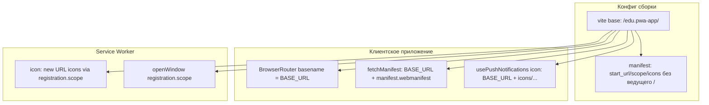

# Creative Phase: GitHub Pages Deploy (`step-github-pages-deploy`)

**Task ID:** `step-github-pages-deploy`  
**Дата:** 2026-08-11  
**Тип:** Architecture (base / CI workflow / PWA paths)  
**Документ:** design decisions для деплоя учебного PWA на GitHub Pages (HTTPS)

**Ограничения:** frontend-only; без новых npm-зависимостей; только pnpm; default branch = `develop`; project site `https://vzagl.github.io/edu.pwa-app/`

**Связанные:** `memory-bank/tasks.md`, `docs/project/implementation-plan.md` (step-github-pages-deploy), [Vite static-deploy / GitHub Pages](https://vite.dev/guide/static-deploy.html#github-pages)

---

## Сводка решений

| ID  | Тема                   | Выбранный вариант                                                                  |
| --- | ---------------------- | ---------------------------------------------------------------------------------- |
| C1  | Стратегия `base`       | **A** — `base: '/edu.pwa-app/'`                                                    |
| C2  | Workflow trigger       | **B + dispatch** — push на `develop` + `workflow_dispatch`; pnpm                   |
| C3  | Выравнивание PWA-путей | **C** — гибрид: relative в manifest · `BASE_URL` в app · `registration.scope` в SW |

---

## 🎨🎨🎨 CREATIVE PHASE C1: Стратегия `base`

### Problem Statement

Приложение должно открываться как **project site** по пути `/edu.pwa-app/`. Без корректного Vite `base` ассеты, SW и клиентский роутер резолвятся от корня `vzagl.github.io/`, а не от subdirectory → 404 и сломанный PWA.

**Требования:**

- Production URL: `https://vzagl.github.io/edu.pwa-app/`
- Локальный `pnpm preview` должен отражать тот же nested path
- Ученику должно быть понятно, _почему_ задан именно такой `base`
- Без лишней динамики/секретов в CI

**Ограничения:**

- Имя репозитория известно и стабильно (`edu.pwa-app`)
- `vite-plugin-pwa` уже в проекте; `import.meta.env.BASE_URL` доступен после задания `base`

### Options Analysis

#### Option A: `base: '/edu.pwa-app/'`

**Description:** Явный absolute base, как в официальной доке Vite для project sites.

**Pros:**

- Совпадает с целевым URL один-в-один
- `BASE_URL` предсказуем в app и тестах
- Максимально прозрачно для учебного объяснения
- Preview ведёт себя как prod (nested path)

**Cons:**

- Хардкод имени репозитория (при rename — правка конфига)

**Complexity:** Low  
**Technical Fit:** High  
**Implementation Time:** ~5–10 мин (одна строка + C3)

#### Option B: `base: './'` (relative)

**Description:** Relative base — пути ассетов относительно файлов; хост/путь «неизвестны» заранее.

**Pros:**

- Гибкость при смене хостинга без правки `base`
- Полезно для `file://` / Electron-сценариев

**Cons:**

- Сложнее рассуждать про SW scope, абсолютные fetch и роутер
- Хуже для учебного «path = имя репо»
- Известные edge cases с absolute URL API

**Complexity:** Medium–High  
**Technical Fit:** Medium  
**Implementation Time:** выше за счёт отладки SW/роутера

#### Option C: env / `GITHUB_REPOSITORY`

**Description:** Вычислять base в CI из имени репо (или `VITE_BASE`), локально — fallback.

**Pros:**

- DRY при fork/rename
- Один конфиг «под любой project site»

**Cons:**

- Усложняет локальный preview и docs
- Для одного учебного репо — overkill
- Риск расхождения CI vs local без явной дисциплины

**Complexity:** Medium  
**Technical Fit:** Medium  
**Implementation Time:** выше (env + docs + проверка)

### Decision — C1

**Chosen:** Option A — `base: '/edu.pwa-app/'`

**Rationale:** Официальная рекомендация Vite для `https://<user>.github.io/<repo>/`; имя репо стабильно; учебная прозрачность важнее абстракции. `import.meta.env.BASE_URL` становится источником истины для C3.

### Implementation Guidelines (C1)

1. В `vite.config.ts`: `base: '/edu.pwa-app/'`.
2. Не дублировать имя репо в app-коде — использовать `import.meta.env.BASE_URL`.
3. В docs (`run-and-build.md`) явно указать: project site → base = `/<repo>/`.
4. После смены base — прогнать preview и убедиться, что ассеты грузятся с `/edu.pwa-app/assets/…`.

### Validation (C1)

- [x] Требование nested path закрыто
- [x] Согласовано с Vite docs
- [x] Не требует новых зависимостей
- [x] Совместимо с последующим C3

🎨🎨🎨 EXITING CREATIVE PHASE C1 — DECISION MADE 🎨🎨🎨

---

## 🎨🎨🎨 CREATIVE PHASE C2: Workflow trigger

### Problem Statement

Нужен GitHub Actions workflow: `pnpm build` → publish `dist/` на Pages. Пример Vite рассчитан на ветку `main` и **npm**; в этом репозитории default branch = **`develop`**, менеджер пакетов — **только pnpm** (`preinstall` / `only-allow`).

**Требования:**

- Деплой на HTTPS Pages через Actions
- CI не использует npm (`npm ci` сломает install)
- Не деплоить произвольный WIP с feature-веток автоматически
- Возможность ручного перезапуска деплоя

**Ограничения:**

- Settings → Pages → Source = GitHub Actions (ручной шаг владельца)
- Permissions: `pages: write`, `id-token: write`
- Concurrency group `pages`

### Options Analysis

#### Option A: только `main`

**Description:** Как в примере Vite: `on.push.branches: ['main']` (+ опционально dispatch).

**Pros:**

- Буквально совпадает с официальным YAML

**Cons:**

- `main` не является default в этом репо → автодеплой не сработает без rename/дублирования веток
- Противоречит git-workflow проекта (работа через `develop`)

**Complexity:** Low (но неверно для репо)  
**Technical Fit:** Low  
**Implementation Time:** копипаста примера

#### Option B: `develop`

**Description:** Trigger на push в `develop` (default / интеграционная ветка).

**Pros:**

- Совпадает с git-workflow и Memory Bank (feature → develop)
- Merge в develop = обновление учебного стенда
- Feature-ветки не деплоятся автоматически

**Cons:**

- `develop` одновременно «интеграция» и «прод Pages» (для учебного проекта приемлемо)
- Отличается от текста примера Vite (нужна пометка в docs)

**Complexity:** Low  
**Technical Fit:** High  
**Implementation Time:** ~15–20 мин (YAML + pnpm)

#### Option C: только `workflow_dispatch`

**Description:** Только ручной запуск из вкладки Actions (ветка выбирается при запуске).

**Pros:**

- Полный контроль; нет сюрпризов от merge

**Cons:**

- Легко забыть задеплоить после merge
- Риск осознанно задеплоить нестабильную feature-ветку

**Complexity:** Low  
**Technical Fit:** Medium (как единственный trigger)  
**Implementation Time:** низкое

### Decision — C2

**Chosen:** Option B + `workflow_dispatch` (не «только C»)

**Rationale:** Автодеплой с `develop` закрывает обычный поток; `workflow_dispatch` даёт ручной перезапуск без пустого коммита. Адаптация примера Vite: `main` → `develop`, npm → pnpm (`pnpm/action-setup` + cache pnpm, `pnpm install --frozen-lockfile` / `pnpm build`).

### Implementation Guidelines (C2)

1. Создать `.github/workflows/deploy.yml`.
2. `on:`
   - `push.branches: [develop]`
   - `workflow_dispatch:`
3. `permissions:` `contents: read`, `pages: write`, `id-token: write`.
4. `concurrency:` group `pages`, `cancel-in-progress: true` (или `false` — по вкусу; в примере Vite — `true`).
5. Steps (ориентир на актуальные action SHA/версии из Vite docs, адаптируя пакетный менеджер):
   - `actions/checkout`
   - `pnpm/action-setup` (версия из `packageManager`)
   - `actions/setup-node` с `cache: 'pnpm'`
   - `pnpm install` / `pnpm build`
   - `actions/configure-pages`
   - `actions/upload-pages-artifact` path `./dist`
   - `actions/deploy-pages`
6. В docs: Settings → Pages → GitHub Actions; первый деплой может потребовать ручного enable.
7. **Не** копировать `npm ci` / `cache: npm` из примера Vite.

### Validation (C2)

- [x] Учтён default branch `develop`
- [x] Учтён only-allow pnpm
- [x] Есть ручной trigger
- [x] Feature-ветки не деплоятся по push

🎨🎨🎨 EXITING CREATIVE PHASE C2 — DECISION MADE 🎨🎨🎨

---

## 🎨🎨🎨 CREATIVE PHASE C3: Выравнивание PWA-путей

### Problem Statement

Даже с корректным `base` приложение сломается на Pages, пока остаются абсолютные пути от корня домена и роутер без `basename`:

| Место                                  | Сейчас                  | Риск на Pages                   |
| -------------------------------------- | ----------------------- | ------------------------------- |
| Manifest `start_url` / `scope` / icons | `/`, `/icons/…`         | Вне subdirectory                |
| `fetchManifest`                        | `/manifest.webmanifest` | 404                             |
| `BrowserRouter`                        | без `basename`          | Клиентские маршруты мимо base   |
| `usePushNotifications` icon            | `/icons/icon-192.png`   | Битая иконка                    |
| `sw-push.js` icon / `openWindow('/')`  | абсолютный `/`          | Корень github.io, не приложение |
| Lesson copy SW                         | «scope = `/`»           | Устареет при base               |

**Требования:**

- Manifest, SW, icons, router работают под `/edu.pwa-app/`
- Не хардкодить имя репо в runtime-коде (кроме единственного `base` в vite.config)
- `sw-push.js` — чистый JS без `import.meta`
- Минимальный дифф, учебная ясность

### Options Analysis

#### Option A: только relative (без ведущего `/`) + basename

**Description:** В manifest — `icons/icon-192.png`, `start_url: './'`; роутер с basename; остальное «как получится».

**Pros:**

- Мало явного `BASE_URL` в TS
- Manifest relative URL резолвятся относительно URL манифеста

**Cons:**

- SW всё равно не получает relative «бесплатно» для `openWindow('/')`
- Непоследовательность: часть кода relative, часть забыта

**Complexity:** Medium  
**Technical Fit:** Medium

#### Option B: везде `import.meta.env.BASE_URL`

**Description:** Все URL в app строить через `BASE_URL`; в manifest тоже пытаться выразить через base.

**Pros:**

- Единообразие в TypeScript
- Явная связь с Vite `base`

**Cons:**

- `public/sw-push.js` **не** видит `import.meta.env` (не бандлится как Vite-модуль в том же виде)
- Пришлось бы дублировать строку `/edu.pwa-app/` в SW или inject — хуже Option C

**Complexity:** Medium  
**Technical Fit:** Medium (ломается на SW)

#### Option C: гибрид

**Description:** Три слоя правил:

1. **Manifest (vite.config):** пути без ведущего `/` (`./`, `icons/…`) — plugin + `base` собирают корректный webmanifest.
2. **App (TS/TSX):** `import.meta.env.BASE_URL` + `BrowserRouter basename={import.meta.env.BASE_URL}`.
3. **SW (`sw-push.js`):** `new URL('icons/icon-192.png', self.registration.scope)` и `openWindow(self.registration.scope)` — scope уже включает subdirectory.

**Pros:**

- Нет хардкода имени репо вне `vite.config`
- SW устойчив к смене base (пока scope соответствует регистрации)
- Ясные правила «где какой паттерн» для BUILD и docs

**Cons:**

- Три правила вместо одного — нужно зафиксировать в creative/docs

**Complexity:** Medium  
**Technical Fit:** High

### Decision — C3

**Chosen:** Option C — гибрид

**Rationale:** Разные среды (Vite-бандл / static SW / manifest generator) требуют разных механизмов; гибрид использует сильные стороны каждой без дублирования `/edu.pwa-app/` в runtime.

### Visualization

### Implementation Guidelines (C3)

1. **`vite.config.ts` (manifest):**
   - `start_url: './'` (или эквивалент, согласованный с plugin)
   - `scope: './'` (или `.` — проверить выход `manifest.webmanifest` после build)
   - icons: `src: 'icons/icon-192.png'` / `icons/icon-512.png` (без ведущего `/`)
2. **`src/main.tsx`:** `basename={import.meta.env.BASE_URL}`.
3. **`fetchManifest.ts`:**  
   `const url = new URL('manifest.webmanifest', import.meta.env.BASE_URL).href`  
   (или конкатенация с нормализацией слэшей).
4. **`usePushNotifications`:** icon через `BASE_URL`.
5. **`public/sw-push.js`:**
   - icon: `new URL('icons/icon-192.png', self.registration.scope).href`
   - click: `clients.openWindow(self.registration.scope)` (или `scope` + путь)
6. **Lesson copy** (`swLessonData`, тексты на SW-экране): не утверждать жёстко `scope = /`; формулировать через «scope регистрации / base path» или показывать фактический `info.scope`.
7. **Тесты:** обновить ожидания URL/фикстуры; для unit с `BASE_URL` — учесть, что в Vitest `BASE_URL` зависит от конфига Vite (после C1 станет `/edu.pwa-app/`).
8. **E2E:** `vite preview` отдаёт app под base; при падении маршрутов — проверить Playwright `baseURL` / пути (не ломать без нужды; зафиксировать в BUILD).
9. **`navigateFallbackDenylist`:** оставить смысловой deny для API; при необходимости сверить поведение Workbox под subdirectory в BUILD.

### Validation (C3)

- [x] Manifest/icons/router/SW покрыты правилами
- [x] Нет зависимости SW от `import.meta`
- [x] Имя репо не дублируется в runtime
- [x] Согласовано с C1 (`BASE_URL` / scope)

🎨🎨🎨 EXITING CREATIVE PHASE C3 — DECISION MADE 🎨🎨🎨

---

## Общие Implementation Guidelines (для `/build`)

Порядок фаз из `tasks.md`:

1. **Phase 1 — Base + PWA paths:** C1 + C3 (vite.config, main, fetchManifest, push, lesson copy, unit-тесты).
2. **Phase 2 — Actions:** C2 (`.github/workflows/deploy.yml`).
3. **Phase 3 — Docs:** `run-and-build.md`, `pwa-checklist.md` (URL, Settings → Pages, проверка на HTTPS).
4. **Phase 4 — Verify:** `pnpm verify:fast` (+ e2e при необходимости); после merge — ручная проверка Pages.

**Не в scope:** README learner guide (`step-readme-learner-guide`).

---

## ✓ CREATIVE PHASE VERIFICATION

- Problem clearly defined? **YES** (C1–C3)
- Multiple options considered (3+ per phase)? **YES**
- Pros/cons documented? **YES**
- Decision with rationale? **YES**
- Implementation plan included? **YES**
- Visualization/diagrams? **YES** (C3 + сводка)
- tasks.md updated with decision? **YES** (после записи этого файла)

**Quality score (ориентир metrics):** Documentation 10 + Decision coverage 10 + Option analysis 10 + Impact 8 + Verification 8 ≈ **46/50** (≥ 80%)

---

## Next Steps

→ **`/build`** — реализация по Phase 1–4 с опорой на решения C1–C3.
