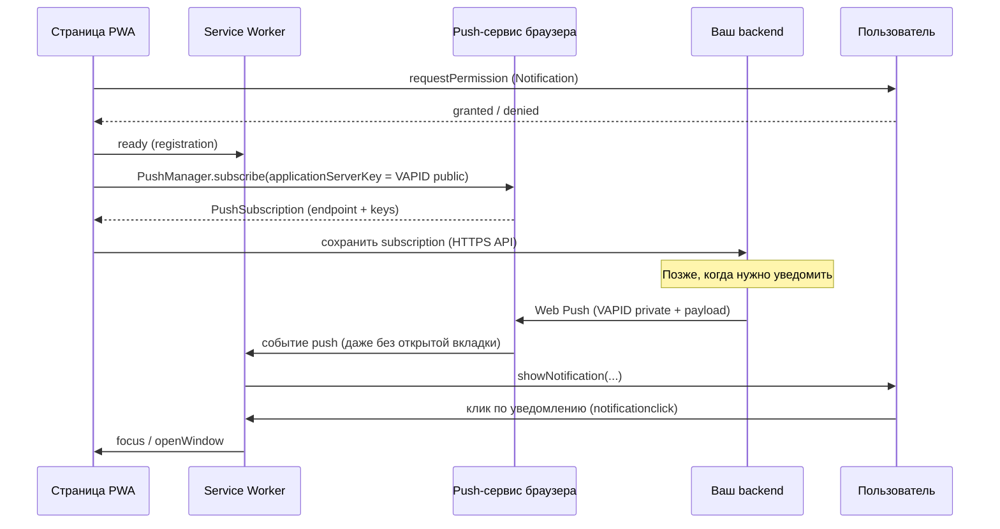

# Creative Phase: Web Push (`step-push-notifications`)

**Task ID:** `step-push-notifications`  
**Дата:** 2026-08-11  
**Тип:** Architecture + SW integration + UI/UX  
**Документ:** design decisions + учебный контекст Web Push для урока `/push`

**Style Guide:** `memory-bank/style-guide.md`, `docs/project/ui-conventions.md`  
**Ограничения:** frontend-only (AGENTS.md); без продакшен-backend в репозитории; паттерн lesson-ui как Install/Storage

---

## 0. Учебный контекст: что такое Web Push

> Этот раздел — источник смыслов для `pushLessonData` и текстов UI. BUILD должен перенести ключевые формулировки в экран урока (кратко), не копируя весь документ целиком.

### 0.1. Что это

**Web Push** — стандарт, позволяющий **серверу** доставить сообщение в браузер пользователя **даже когда вкладка сайта закрыта** (пока установлен/зарегистрирован Service Worker и есть активная подписка).

Важно различать два разных механизма:

| Механизм                                     | Кто инициирует                             | Когда работает                   | Backend нужен? |
| -------------------------------------------- | ------------------------------------------ | -------------------------------- | -------------- |
| **Notification API** (локальное уведомление) | Сама страница или SW по локальному событию | Пока есть контекст (страница/SW) | Нет            |
| **Web Push** (удалённая доставка)            | Ваш сервер → push-сервис браузера → SW     | Вкладка может быть закрыта       | **Да**         |

Локальное `registration.showNotification()` учит UI уведомлений и роль SW, но это **не** «push с сервера». Настоящий Web Push — когда сообщение приходит извне через push-сервис (FCM / Mozilla Autopush / Apple и т.п.).

### 0.2. Зачем это нужно (в реальных приложениях)

Типичные сценарии:

- заказ изменил статус («курьер рядом») при закрытой вкладке;
- напоминание / сообщение в мессенджере / соцсети;
- критичные алерты (безопасность, дедлайн), когда пользователь не смотрит сайт.

Для **учебного** PWA цель другая: понять цепочку Permission → подписка → SW → (в проде) backend, а не построить продакшен-рассылку.

### 0.3. Как это работает (упрощённая цепочка)

Ключевые участники:

1. **Permission** — пользователь явно разрешает уведомления (`default` → `granted` / `denied`).
2. **PushManager.subscribe** — браузер создаёт подписку у **push-сервиса** (не у вашего сервера напрямую).
3. **PushSubscription** — объект с `endpoint` и ключами; его нужно **передать и хранить на backend**.
4. **VAPID** — пара ключей: **public** в клиенте при subscribe; **private** только на сервере для подписи запросов отправки.
5. **Service Worker** — обрабатывает `push` (показать уведомление) и `notificationclick` (открыть/сфокусировать приложение).
6. **Backend** — хранит подписки и **отправляет** сообщения по Web Push protocol.

### 0.4. Что должен делать backend в реальном приложении

Минимальный набор обязанностей сервера:

1. **Принять и сохранить** `PushSubscription` (endpoint, keys) после subscribe на клиенте — обычно `POST /api/push/subscribe` + привязка к пользователю/устройству.
2. **Хранить VAPID private key** в секретах окружения (не в git, не в статике GitHub Pages).
3. **Отправлять push** библиотекой вроде `web-push` (Node) / аналог: подпись VAPID, шифрование payload, HTTP POST на `endpoint`.
4. **Обработать ошибки доставки** — истекшая/отозванная подписка (410 Gone и т.п.) → удалить из БД.
5. **Отписка** — `POST /api/push/unsubscribe` или удаление записи при `PushSubscription.unsubscribe()` на клиенте.
6. **Политика контента** — что слать, частота, согласие пользователя, тихие часы (продуктовые/юридические правила).
7. **Не отдавать private VAPID** на клиент и не хранить подписки только в `localStorage` как «единственный» источник истины для рассылки.

Опционально (часто забывают):

- **ротация ключей VAPID** и миграция подписок;
- **TTL / urgency** заголовков Web Push;
- **разные payload** для разных платформ (лимиты размера);
- **аналитика** доставки / кликов (осторожно с приватностью);
- **fallback-каналы** (email/SMS), если push недоступен (Safari/iOS ограничения, denied).

### 0.5. HTTPS, GitHub Pages и почему «деплой ≠ push-сервер»

- Web Push и SW требуют **secure context** (HTTPS; `localhost` — исключение для разработки).
- **GitHub Pages** даёт HTTPS-статику: приложение, SW, install, offline — да.
- Pages **не** выполняет серверный код: не хранит подписки и не шлёт Web Push.
- Поэтому `step-github-pages-deploy` улучшает проверку PWA на настоящем HTTPS, но **не** закрывает «сервер → клиент».
- Полная доставка с сервера — **отдельный** backend (Cloud Function, Worker, свой API) вне этого frontend-репозитория.

### 0.6. Ограничения платформ (обязательно в уроке)

- **Safari / iOS:** Web Push для веб-приложений ограничен (часто нужен Add to Home Screen / конкретные версии ОС); часть сценариев недоступна как в Chrome Desktop.
- **Permission `denied`:** пользователь должен менять разрешение в настройках браузера — страница не «перезапросит» бесконечно.
- **Без SW** подписка Push невозможна в нормальном сценарии PWA.
- **Без backend** можно: permission, subscribe (получить endpoint), локальные уведомления, симуляция Push в DevTools — но не массовая/удалённая рассылка «с сервера».

### 0.7. Что ещё полезно объяснить ученику (добавления к запросу)

Помимо «что / как / зачем / что делает backend», в уроке стоит кратко закрыть:

| Тема                                             | Зачем                                                                   |
| ------------------------------------------------ | ----------------------------------------------------------------------- |
| Разница Notification vs Web Push                 | Чтобы не путать локальный демо-кнопочный notify с серверной доставкой   |
| Роль push-сервиса браузера                       | Понять, что `endpoint` — не URL вашего API                              |
| VAPID public vs private                          | Безопасность: private только на сервере                                 |
| События SW `push` / `notificationclick`          | Связь с уроком Service Worker                                           |
| DevTools → Application → Service Workers → Push  | Как проверить handler без backend                                       |
| Почему GitHub Pages не заменяет backend          | Ожидания после деплоя                                                   |
| Жизненный цикл подписки (истечение, resubscribe) | Реализм продакшена                                                      |
| Consent / UX permission                          | Не спрашивать permission на первом экране без контекста (best practice) |

---

## 🎨🎨🎨 ENTERING CREATIVE PHASE: Architecture 🎨🎨🎨

**Фокус:** mock vs backend vs гибрид  
**Цель:** учебный сценарий без продакшен-backend в repo  
**Requirements:** Permission, поддержка Push, subscribe/unsubscribe, честные тексты про сервер/HTTPS

### Problem Statement

Как показать Web Push в frontend-only учебном PWA, не создавая ложного ощущения «полного» цикла серверной доставки и не таща backend в репозиторий?

### Options Analysis

#### Option 1: Pure mock

**Description:** Хук полностью мокает `PushManager` / `PushSubscription`; UI показывает выдуманные статусы.

**Pros:**

- Стабильные unit/E2E без HTTPS
- Нет VAPID и секретов

**Cons:**

- Слабая связь с реальным браузером
- Легко сформировать неверную ментальную модель

**Complexity:** Low  
**Technical Fit:** Medium (для тестов — да; для обучения API — слабо)

#### Option 2: Минимальный backend в/рядом с проектом

**Description:** Express / Serverless + VAPID + сохранение subscription + кнопка «отправить push».

**Pros:**

- Полный цикл «сервер → клиент»
- Максимальная учебная полнота протокола

**Cons:**

- Противоречит AGENTS.md (нет backend в repo) и roadmap «только frontend»
- Секреты, деплой API, scope creep для опционального урока
- GitHub Pages всё равно не хостит этот backend

**Complexity:** High  
**Technical Fit:** Low для текущего проекта

#### Option 3: Гибрид (рекомендуется)

**Description:**

- Живые `Notification.permission` / `requestPermission`
- Демо локального уведомления: `registration.showNotification()` при `granted`
- `PushManager.subscribe` с учебным **VAPID public** key при secure context + SW (если невозможно — понятная ошибка в UI)
- Handlers SW для `push` / `notificationclick` (в т.ч. симуляция из DevTools)
- **Нет** сервера отправки; в контенте явно: что делает backend в реальном приложении и почему его нет здесь
- Unit-тесты — на моках браузерных API

**Pros:**

- Соответствует frontend-only
- Живые Permission / Notification / (по возможности) subscribe
- Честная граница «что умеет урок / что нужно в проде»
- Согласуется с паттерном Install (живые статусы + пояснения)

**Cons:**

- Нет кнопки «пришло с нашего сервера» без внешнего API
- Нужна аккуратная копирайтинг-дисциплина в UI

**Complexity:** Medium  
**Technical Fit:** High

### Decision

**Chosen:** Option 3 — Гибрид.

**Rationale:** Цель шага — понимание цепочки и API, не продакшен-рассылка. Backend в repo запрещён политикой проекта; GitHub Pages не заменит отправителя. Гибрид даёт максимум практики в этих рамках и оставляет путь к отдельной будущей задаче «внешний push-backend», если понадобится.

### Implementation guidelines (Architecture)

- Хук `usePushNotifications`: `supported`, `permission`, `subscription` (snapshot), `requestPermission`, `subscribe`, `unsubscribe`, `showLocalNotification`, `error`/`message`
- Учебный VAPID **public** — в клиентском модуле/конфиге урока; private **не** коммитить
- В `pushLessonData` — блоки: что такое Web Push, цепочка, роль backend, Pages ≠ backend, iOS/Safari
- Новые npm-зависимости для отправки push **не** добавлять

### Validation

- [x] Без backend в repo
- [x] Живое демо permission + local notification
- [x] Subscribe без обещания серверной доставки
- [x] Учебный контент покрывает «что / как / зачем / backend»

🎨🎨🎨 EXITING CREATIVE PHASE — Architecture 🎨🎨🎨

---

## 🎨🎨🎨 ENTERING CREATIVE PHASE: SW integration 🎨🎨🎨

**Фокус:** как добавить `push` / `notificationclick` при текущем `generateSW`  
**Цель:** показать роль SW в доставке без миграции на `injectManifest`

### Problem Statement

Сейчас `vite-plugin-pwa` использует `generateSW` + Workbox precache/runtimeCaching. Нужны учебные handlers Push, не ломая offline/install.

### Options Analysis

#### Option 1: generateSW + `importScripts`

**Description:** `public/sw-push.js` + `workbox.importScripts: ['sw-push.js']` в `vite.config.ts`.

**Pros:** Минимальный diff; DevTools Push работает; precache сохраняется  
**Cons:** Отдельный static-файл  
**Complexity:** Low–Medium

#### Option 2: injectManifest

**Description:** Полный кастомный SW с Workbox вручную.

**Pros:** Полный контроль  
**Cons:** Миграция, риск регрессии offline/install, overkill  
**Complexity:** High

#### Option 3: Без SW-handlers

**Description:** Только page-side Notification + теория.

**Pros:** Ноль риска SW  
**Cons:** Слабее урок про роль SW и DevTools Push  
**Complexity:** Low

### Decision

**Chosen:** Option 1 — `generateSW` + `importScripts('sw-push.js')`.

**Rationale:** Достаточно для события `push` из DevTools и `notificationclick`; не меняет стратегию SW всего приложения.

### Implementation guidelines (SW)

- `public/sw-push.js`:
  - `push` → `event.waitUntil(self.registration.showNotification(...))`; текст из `event.data` или fallback «Учебный push (нет payload)»
  - `notificationclick` → `event.notification.close()` + `clients.openWindow('/')` / focus существующего окна
- В `vite.config.ts`: `workbox.importScripts: ['sw-push.js']`
- Не переключать на `injectManifest` в этой задаче
- В уроке: инструкция DevTools → Application → Service Workers → Push

### Validation

- [x] Роль SW показана практически
- [x] Нет ломки текущей PWA-стратегии
- [x] Scope ограничен одним файлом + одной строкой конфига

🎨🎨🎨 EXITING CREATIVE PHASE — SW integration 🎨🎨🎨

---

## 🎨🎨🎨 ENTERING CREATIVE PHASE: UI/UX 🎨🎨🎨

**Фокус:** состояния permission/подписки, кнопки, тексты про HTTPS/VAPID/iOS/backend  
**Паттерн:** как `InstallScreen` — badge + `dl` + условные кнопки + секции

### Problem Statement

Как дать понятное живое демо и объяснить границы гибрида, не делая E2E зависимым от grant permission?

### Options Analysis

#### Option 1: Только теория

**Pros:** Просто  
**Cons:** Нет практики API  
**Complexity:** Low

#### Option 2: Живое демо как Install (рекомендуется)

**Pros:** Единый паттерн уроков; TDD на моках; ясная обратная связь  
**Cons:** Нужна аккуратная матрица состояний  
**Complexity:** Medium

#### Option 3: Wizard из 3 шагов

**Pros:** Линейный сценарий  
**Cons:** Лишняя сложность для одного экрана  
**Complexity:** Medium–High

### Decision

**Chosen:** Option 2 — живое демо по образцу Install.

### UX spec

**Бейдж статусов:** `unsupported` | `default` | `denied` | `granted` | `subscribed`

**Кнопки (условно):**

| Кнопка                         | Когда                                  |
| ------------------------------ | -------------------------------------- |
| Запросить разрешение           | `permission === 'default'` и supported |
| Подписаться                    | `granted` и нет subscription           |
| Отписаться                     | есть subscription                      |
| Показать локальное уведомление | `granted` (главное демо без сервера)   |

**Поля `dl`:** supported, permission, hasSubscription, endpoint (укороченный), при ошибке — сообщение

**Секции экрана (порядок):**

1. Intro — что такое Web Push и зачем (кратко)
2. Как работает — Permission → subscribe → push-сервис → SW; отдельно Notification vs Push
3. Демо — бейдж + кнопки + `dl`
4. Роль backend — что делает сервер в реальном приложении; почему в этом repo его нет
5. DevTools — симуляция Push
6. Ограничения — HTTPS, Safari/iOS, GitHub Pages ≠ отправитель
7. Ссылка на урок Service Worker

**E2E:** заголовок, регионы, nav; **без** обязательного grant permission.

**A11y:** `role="region"`, `aria-labelledby`, бейдж `role="status"`, понятные `aria-label` кнопок.

### Validation

- [x] Style guide / ui-conventions соблюдены концептуально (BEM `push-screen__`)
- [x] Состояния покрывают unsupported/denied
- [x] Учебные темы из §0 отражены в структуре секций
- [x] E2E не хрупок к permission

🎨🎨🎨 EXITING CREATIVE PHASE — UI/UX 🎨🎨🎨

---

## Сводка решений

| Фаза         | Решение                                                                                                       |
| ------------ | ------------------------------------------------------------------------------------------------------------- |
| Architecture | Гибрид: живые Permission/Notification + local notify; subscribe без backend-отправки; честный учебный контент |
| SW           | `generateSW` + `importScripts('sw-push.js')`                                                                  |
| UX           | Паттерн Install; секции включают «что/как/зачем/backend/Pages/iOS»                                            |

**Документ:** `memory-bank/creative/creative-push-notifications.md`  
**Следующий режим:** `/build`

---

## ✓ CREATIVE PHASE VERIFICATION

- Problem clearly defined? YES
- Multiple options considered (3+ per phase)? YES
- Pros/cons documented? YES
- Decision + rationale? YES
- Implementation guidelines? YES
- Visualization/diagrams? YES (sequence + таблицы)
- Educational context (что / как / зачем / backend)? YES
- tasks.md updated with decisions? (при записи Memory Bank)

---

## CREATIVE PHASES COMPLETE

Все требуемые дизайн-решения зафиксированы.  
Рекомендуемый следующий шаг: **`/build`**.
