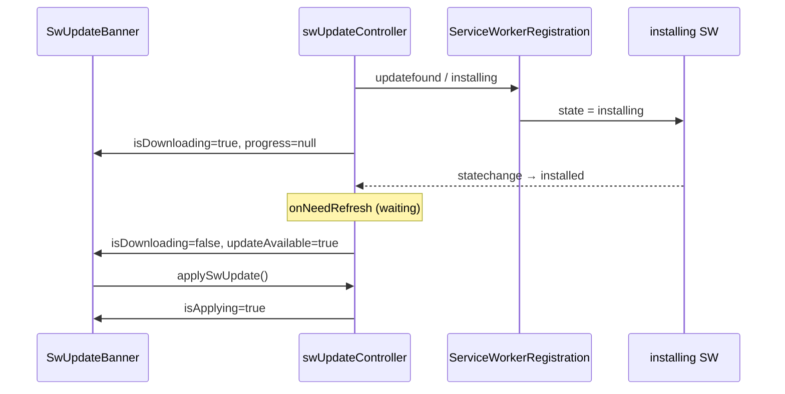

# Creative Phase: Прогресс загрузки SW / precache (`step-sw-update-download-progress`)

**Task ID:** `step-sw-update-download-progress`  
**Дата:** 2026-08-12  
**Тип:** Architecture + UI/UX  
**Документ:** design decisions для индикатора фонового install/precache

**Style Guide:** `memory-bank/style-guide.md`, `docs/project/ui-conventions.md`  
**Ограничения:** `generateSW` + `virtual:pwa-register`; push через `importScripts: ['sw-push.js']`; учебная ясность > точный %; не ломать offline / GitHub Pages `base`

---

## Зафиксированный UX (из PLAN)

1. Фоновое скачивание (`installing` / precache) → показать прогресс
2. Скачивание завершено (SW в `waiting`) → убрать прогресс, кнопка **«Обновить»**
3. После клика «Обновить» → **«Обновляется…»** без % (activate + reload)

---

## 🏗️ Architecture: источник прогресса

### Problem Statement

`onNeedRefresh` (`virtual:pwa-register`) срабатывает, когда новый SW уже в `waiting` — precache к этому моменту завершён. Нужен сигнал **во время** `installing`, без поломки текущего `generateSW` и push.

### Options Analysis

#### Option A: Lifecycle клиента (indeterminate)

Слушать `ServiceWorkerRegistration`: `updatefound` / `installing` + `statechange`.  
Состояние: `isDownloading = true`, `downloadProgress = null` (indeterminate), пока worker в `installing`; при `installed` / `onNeedRefresh` — сброс download, показ apply-баннера.

|                   |                                                                        |
| ----------------- | ---------------------------------------------------------------------- |
| **Pros**          | Минимальный риск; без смены SW; TDD на state-машине; понятно для урока |
| **Cons**          | Нет точного процента                                                   |
| **Сложность**     | Low                                                                    |
| **Technical Fit** | High                                                                   |

#### Option B: `injectManifest` + `postMessage` (точный %)

Кастомный SW: подсчёт precache → `postMessage` в клиент.

|                   |                                                                                               |
| ----------------- | --------------------------------------------------------------------------------------------- |
| **Pros**          | Точный %                                                                                      |
| **Cons**          | Миграция SW / push / runtimeCaching / navigateFallback; на маленьком бандле % часто незаметен |
| **Сложность**     | High                                                                                          |
| **Technical Fit** | Medium (учебный риск > ценность)                                                              |

#### Option C: Hybrid / события `workbox-window`

Класс Workbox вместо / рядом с `registerSW` — события waiting/controlling есть, прогресса precache без кастомного SW нет.

|                   |                                                           |
| ----------------- | --------------------------------------------------------- |
| **Pros**          | Явные lifecycle-события библиотеки                        |
| **Cons**          | Без %; усложняет текущую регистрацию; по сути дублирует A |
| **Сложность**     | Medium                                                    |
| **Technical Fit** | Low–Medium                                                |

### Decision: **Option A — Lifecycle + indeterminate**

**Rationale:** закрывает UX «идёт скачивание → готово обновить» без миграции SW; учебный проект выигрывает от ясности Browser Lifecycle API; точный % (B) откладываем.

**Контракт состояния (для BUILD):**

```ts
type SwUpdateState = {
	updateAvailable: boolean;
	isApplying: boolean;
	isDownloading: boolean;
	/** null = indeterminate; число 0..1 — запас на будущее (injectManifest) */
	downloadProgress: number | null;
};
```

**Источник событий (guidelines):**

1. В `onRegisteredSW` сохранить `registration`; подписаться на `updatefound`.
2. На `updatefound` / если уже есть `registration.installing` — взять installing worker, слушать `statechange`.
3. `installing` → `isDownloading = true`, `downloadProgress = null`.
4. `installed` (при наличии controller → waiting) / `onNeedRefresh` → `isDownloading = false`, `updateAvailable = true`.
5. Сброс download при ошибке/редиректе install; не ломать in-flight `applySwUpdate`.
6. **Не** менять `generateSW`, `importScripts`, `vite.config` workbox в этой задаче.

### Visualization



### Architecture Verification

- [x] Требования UX закрыты без точного %
- [x] Push / offline / Pages не затрагиваются стратегией SW
- [x] Интерфейсы (`SwUpdateState`, subscribe) определены
- [x] Риски (поздний `onNeedRefresh`, незаметный %) учтены
- [x] Дверь для Option B позже через `downloadProgress: number`

---

## 🎨 UI/UX: форма индикатора

### Style Guide

`memory-bank/style-guide.md`: обновление SW — ненавязчивый баннер; SCSS/BEM; mobile-first; видимый focus / a11y.

### Options Analysis

#### Option 1: Расширить `SwUpdateBanner` (рекомендуется)

Один bottom-banner, три фазы: download → «Обновить» → «Обновляется…».

|               |                                                  |
| ------------- | ------------------------------------------------ |
| **Pros**      | Единый UX-якорь; мало диффа; уже есть тесты/SCSS |
| **Cons**      | Компонент шире по состояниям                     |
| **Сложность** | Low                                              |

#### Option 2: Отдельный strip + текущий баннер apply

|               |                                              |
| ------------- | -------------------------------------------- |
| **Pros**      | Разделение ролей UI                          |
| **Cons**      | Дубли, мерцание на переходе download→waiting |
| **Сложность** | Medium                                       |

#### Option 3: Только учебный блок на SW-экране

|               |                                   |
| ------------- | --------------------------------- |
| **Pros**      | Хорошо для урока                  |
| **Cons**      | Не закрывает глобальный индикатор |
| **Сложность** | Low (как дополнение)              |

### Decision: **Option 1 — расширить `SwUpdateBanner`**

**Rationale:** соответствует style guide; минимальный дифф; один `role="status"` / progressbar.

**Фазы UI:**

| Фаза     | Условие                          | UI                                                                                                              |
| -------- | -------------------------------- | --------------------------------------------------------------------------------------------------------------- |
| Download | `isDownloading`                  | Текст «Загружается обновление…» + indeterminate progress (`role="progressbar"`), **без** кнопки и без ложного % |
| Waiting  | `updateAvailable && !isApplying` | Как сейчас: «Доступно обновление» + «Обновить»                                                                  |
| Applying | `isApplying`                     | «Обновляется…», кнопка disabled / `aria-busy`                                                                   |

**Дополнительно (Phase 4 BUILD, не отдельный strip):** обновить `swLessonData` / `updateFlowDescription` — описать фазы download → waiting → apply.

### UI/UX Verification

- [x] Style guide учтён
- [x] A11y: progressbar / status / busy
- [x] Mobile-first, тот же bottom bar
- [x] Без ложного процента при indeterminate

---

## Implementation Guidelines (для `/build`)

### Phase 1 — Контракт

1. Расширить `SwUpdateState` (`isDownloading`, `downloadProgress`).
2. Unit-тесты controller (red → green): installing → downloading → waiting → apply.

### Phase 2 — Lifecycle

1. Подписка `updatefound` + `statechange` в `swUpdateController`.
2. Сохранить `generateSW` + push `importScripts`.

### Phase 3 — UI

1. `useSwUpdate` — проброс новых полей.
2. `SwUpdateBanner` — фаза download (indeterminate) + существующие фазы.
3. SCSS: полоса прогресса в BEM рядом с баннером.

### Phase 4 — Урок + docs

1. `swLessonData` — кратко про download progress.
2. `pwa-checklist.md` — ручной сценарий download → banner.

### Phase 5 — Verify

1. `pnpm lint`, typecheck, `test --run`, `build`.
2. E2E smoke при необходимости.
3. Ручной `preview`: две сборки → прогресс → «Обновить» → reload.

### Technology Validation (после CREATIVE)

- [x] Стратегия SW **не** меняется → паритет push / runtimeCaching / navigateFallback **подтверждён** (нет миграции)
- Новые зависимости не требуются

---

## ✓ Creative Phase Quality (кратко)

| Категория         | Оценка                       |
| ----------------- | ---------------------------- |
| Documentation     | OK                           |
| Decision Coverage | Architecture + UI/UX         |
| Option Analysis   | 3 + 3 опции                  |
| Impact            | Низкий риск для push/offline |
| Verification      | Requirements traced          |

**Минимум 80%:** PASS

---

## Итог

| Решение            | Выбор                                     |
| ------------------ | ----------------------------------------- |
| Источник прогресса | **A** — lifecycle клиента, indeterminate  |
| UI                 | **Option 1** — расширить `SwUpdateBanner` |
| `injectManifest`   | **Не** в этой задаче                      |
| Следующий шаг      | `/build`                                  |
