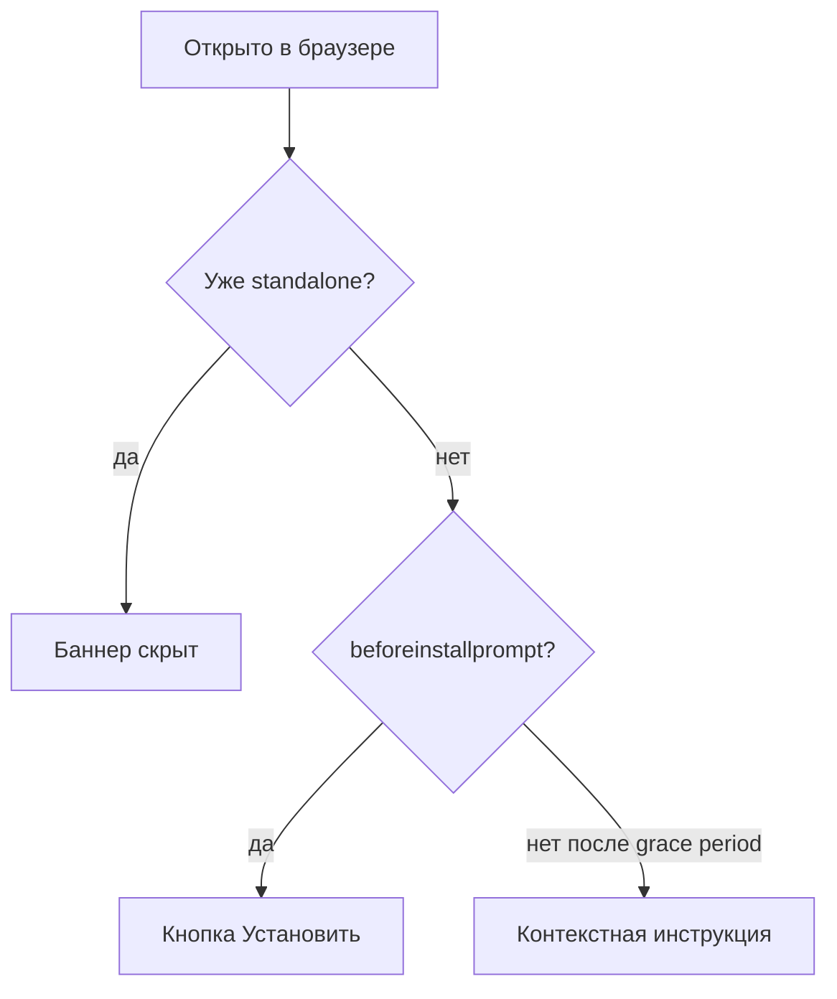

# Tasks

## Current Task

- **Task ID:** `step-install-prompt`
- **Название:** Обработка `beforeinstallprompt` и кнопка «Установить»
- **Уровень сложности:** Level 2 — Simple Enhancement
- **Git Branch:** `feat/step-install-prompt`
- **Фаза:** 5 — Установка PWA (Order: 5.1.1)
- **Статус:** PLAN — завершён, готов к BUILD
- **Дата создания:** 2026-08-06
- **Источник:** [docs/project/implementation-plan.md](../docs/project/implementation-plan.md) (step-install-prompt)

### Описание

Обработка `beforeinstallprompt` (Chromium): отложенный prompt, кнопка «Установить» в UI. **Контекстный fallback** для всех браузеров без programmatic install: Safari/iOS, Firefox (mobile + desktop), Safari macOS, прочие не-Chromium.

### Цель

На поддерживаемых браузерах пользователь может установить приложение из UI.

### Technology Stack

- **Framework:** React 19 + TypeScript
- **Стили:** SCSS (компонент рядом с `.scss`)
- **Тесты:** Vitest + Testing Library (unit), Playwright (E2E)
- **PWA API:** `beforeinstallprompt`, `appinstalled`, `display-mode: standalone`
- **Новые зависимости:** не требуются

### Technology Validation Checkpoints

- [x] Стек определён — существующий React + Vite + Vitest + Playwright
- [x] Зависимости проверены в `package.json` — доп. пакеты не нужны
- [x] Паттерны хуков/баннеров есть: `useOnlineStatus`, `useSwUpdate`, `SwUpdateBanner`, `OfflineIndicator`
- [x] Manifest и SW готовы (зависимости step-web-app-manifest, step-vite-plugin-pwa — ✅)
- [ ] BUILD: `pnpm lint`, `pnpm build`, `pnpm test --run`, `pnpm test:e2e`

### Планируемые файлы

| Файл                                                      | Назначение                                                             |
| --------------------------------------------------------- | ---------------------------------------------------------------------- |
| `src/hooks/useInstallPrompt/useInstallPrompt.ts`          | Хук: перехват `beforeinstallprompt`, deferred prompt, вызов установки  |
| `src/hooks/useInstallPrompt/useInstallPrompt.test.ts`     | Unit-тесты хука                                                        |
| `src/hooks/useInstallPrompt/installFallbackHints.ts`      | Выбор текста подсказки по платформе/браузеру (без UA в логике install) |
| `src/hooks/useInstallPrompt/installFallbackHints.test.ts` | Unit-тесты подсказок                                                   |
| `src/components/InstallBanner/InstallBanner.tsx`          | Баннер: кнопка «Установить» + контекстная fallback-подсказка           |
| `src/components/InstallBanner/InstallBanner.scss`         | Стили баннера (mobile-first, fixed bottom)                             |
| `src/components/InstallBanner/InstallBanner.test.tsx`     | Unit-тесты баннера                                                     |
| `src/App.tsx`                                             | Подключение `<InstallBanner />` в оболочку                             |
| `e2e/install-prompt.spec.ts`                              | E2E: видимость UI установки (fallback-сценарий)                        |

### Совместимость браузеров и устройств

**Принцип:** логика install — только через `beforeinstallprompt` (feature detection). UA-sniffing — **только** для выбора текста fallback, не для решения «можно ли установить».

#### Матрица (типичные браузеры, 2025–2026)

| Браузер                         | Смартфон   | Планшет            | Десктоп            | `beforeinstallprompt` | UI в приложении                                            |
| ------------------------------- | ---------- | ------------------ | ------------------ | --------------------- | ---------------------------------------------------------- |
| **Chrome**                      | ✅ Android | ✅ Android/iPadOS* | ✅ Win/macOS/Linux | ✅                    | Кнопка «Установить»                                        |
| **Edge**                        | ✅ Android | ✅                 | ✅ Win/macOS       | ✅                    | Кнопка «Установить»                                        |
| **Samsung Internet**            | ✅         | —                  | —                  | ✅                    | Кнопка «Установить»                                        |
| **Opera** (Chromium)            | ✅         | ✅                 | ✅                 | ✅                    | Кнопка «Установить»                                        |
| **Firefox**                     | ❌ Android | ❌                 | ❌ Win/macOS/Linux | ❌                    | Fallback: меню браузера                                    |
| **Safari iOS** (предустановлен) | ❌ iPhone  | ❌ iPad            | —                  | ❌                    | Fallback: «Поделиться» → «На экран Домой»                  |
| **Safari macOS**                | —          | —                  | ❌                 | ❌                    | Fallback: «Файл» → «Добавить в Dock»                       |
| **Chrome iOS**                  | ⚠️         | ⚠️                 | —                  | ❌**                  | Fallback (WebKit-оболочка, не полноценный PWA-install API) |

\*iPadOS: Chrome — WebKit-оболочка, install prompt обычно **не** срабатывает; системный Safari — ручная установка.  
\*\*Все браузеры на iOS используют WebKit; programmatic install через `beforeinstallprompt` недоступен.

#### Три режима UI (не два)



1. **Install (Chromium)** — кнопка «Установить» → `deferredPrompt.prompt()`
2. **Fallback (все остальные)** — текстовая инструкция, зависящая от платформы
3. **Hidden** — приложение уже установлено (`display-mode: standalone`, iOS `navigator.standalone`)

#### Тексты fallback (`installFallbackHints.ts`)

| Категория              | Условие детекта (для текста) | Текст подсказки (RU)                                                                      |
| ---------------------- | ---------------------------- | ----------------------------------------------------------------------------------------- |
| `ios`                  | iPhone/iPad/iPod             | «Нажмите «Поделиться» → «На экран Домой»»                                                 |
| `android-non-chromium` | Android + не Chromium UA     | «Откройте меню браузера (⋮) → «Установить приложение» или «Добавить на главный экран»»    |
| `desktop-firefox`      | Firefox на desktop           | «Нажмите значок установки в адресной строке или Меню → «Установить»»                      |
| `desktop-safari`       | Safari macOS                 | «В меню «Файл» выберите «Добавить в Dock»»                                                |
| `generic`              | всё остальное                | «Установите через меню браузера: «Установить приложение» или «Добавить на главный экран»» |

**Grace period:** после mount подождать ~1 с; если `beforeinstallprompt` не пришёл и не `isInstalled` → показать fallback с подходящим текстом. Не полагаться на синхронную проверку `'onbeforeinstallprompt' in window` — событие асинхронное и может не прийти даже в Chrome (критерии PWA не выполнены).

#### Адаптивность layout (все режимы)

- **Смартфон:** fixed bottom, safe-area, кнопка min 44×44 px
- **Планшет:** тот же баннер, чуть больше padding (как `SwUpdateBanner`)
- **Десктоп:** тот же паттерн; fallback-текст может быть длиннее — перенос строк, не обрезать

### Implementation Plan

#### 1. Утилита `installFallbackHints.ts` (TDD)

- `getInstallFallbackHint(): string` — чистая функция, UA через `navigator.userAgent` (только для текста)
- Unit-тесты на каждую категорию (мок UA) + `generic` fallback
- Без внешних зависимостей

#### 2. Хук `useInstallPrompt` (TDD: red → green → refactor)

**API хука:**

```typescript
type InstallPromptState = {
	canInstall: boolean; // deferred prompt доступен (Chromium)
	showFallback: boolean; // не standalone, prompt не пришёл (grace period истёк)
	fallbackHint: string; // контекстный текст из installFallbackHints
	isInstalled: boolean; // уже установлено (standalone)
	promptInstall: () => Promise<void>;
};
```

**Логика:**

1. При монтировании — определить `isInstalled`:
   - `matchMedia('(display-mode: standalone)').matches`
   - iOS Safari: `navigator.standalone === true`
2. Слушать `beforeinstallprompt`:
   - `event.preventDefault()` — отложить нативный prompt
   - сохранить `event` в ref/state → `canInstall: true`, `showFallback: false`
3. `promptInstall()`:
   - вызвать `deferredPrompt.prompt()`
   - дождаться `userChoice` (опционально для логики)
   - сбросить deferred prompt → `canInstall: false`
4. Слушать `appinstalled` → `isInstalled: true`, скрыть баннер
5. Grace period (~1000 ms): если `!isInstalled && !canInstall` → `showFallback: true`, `fallbackHint = getInstallFallbackHint()`
6. Cleanup: снять все listeners + clear timeout при unmount

**TypeScript:** локальный интерфейс `BeforeInstallPromptEvent` (extends `Event` + `prompt()`, `userChoice`) — не в стандартных lib DOM.

**Тесты хука (Vitest):**

- начальное состояние: `canInstall: false`, `isInstalled: false`
- при dispatch `beforeinstallprompt` → `canInstall: true`, `preventDefault` вызван
- `promptInstall()` вызывает `prompt()` на сохранённом событии
- после `appinstalled` → `isInstalled: true`
- при `display-mode: standalone` → `isInstalled: true`, баннер не нужен
- после grace period без BIP → `showFallback: true` + корректный `fallbackHint`
- отписка от событий и таймера при unmount

#### 3. Компонент `InstallBanner` (TDD)

**Поведение (по аналогии с `SwUpdateBanner`):**

- `isInstalled` → `return null`
- `canInstall` → баннер с кратким текстом + кнопка «Установить» (`role="status"`, `aria-label` на кнопке)
- `showFallback` → баннер с `fallbackHint` (без кнопки install; платформо-специфичный текст)
- Клик «Установить» → `promptInstall()` из хука
- Приоритет: если позже придёт `beforeinstallprompt` — переключиться с fallback на кнопку

**Размещение в layout:**

- Fixed bottom (как `SwUpdateBanner`), `z-index: 105` (между SW-баннером 100 и offline-chip 110)
- Если оба баннера видны — `InstallBanner` выше `SwUpdateBanner` (CSS `bottom` offset или flex-column в контейнере)
- Подключить в `App.tsx` рядом с `<SwUpdateBanner />` и `<OfflineIndicator />`

**Тесты баннера:**

- не рендерится при `isInstalled`
- показывает кнопку «Установить» при `canInstall`
- показывает контекстный fallback-текст при `showFallback` (мок разных hint)
- клик по кнопке вызывает `promptInstall`

#### 4. Стили `InstallBanner.scss`

- Mobile-first, safe-area (`env(safe-area-inset-bottom)`)
- Кнопка: min 44×44px, `:focus-visible`, accent-цвета из CSS-переменных (`--color-accent`)
- Тёмная тема: `prefers-color-scheme: dark` (по образцу `OfflineIndicator`)
- Не перекрывать навигацию и контент критично

#### 5. Интеграция в `App.tsx`

```tsx
<InstallBanner />
<SwUpdateBanner />
```

Порядок: InstallBanner выше в DOM → при стекинге снизу fallback/install виден над update.

#### 6. E2E `e2e/install-prompt.spec.ts`

**Оговорка:** `beforeinstallprompt` в headless Playwright/Chromium CI **не гарантирован**. E2E покрывает стабильный сценарий:

- Открыть `/` на `pnpm preview`
- Дождаться активации SW (паттерн из `offline-fallback.spec.ts`)
- Дождаться grace period (~1.5 с) → проверить видимость fallback-баннера (`getByRole('status')`)
- Текст содержит общую подсказку (generic или install — в зависимости от CI Chromium)
- При наличии кнопки «Установить» — проверить `toBeVisible()` (без реального клика install в CI)

**Ручная матрица проверки** (зафиксировать в reflection, не в E2E):

| Среда                  | Ожидание                                 |
| ---------------------- | ---------------------------------------- |
| Chrome Android         | Кнопка «Установить»                      |
| Chrome desktop         | Кнопка «Установить»                      |
| Firefox desktop/mobile | Fallback с текстом про меню              |
| Safari iOS             | Fallback «Поделиться» → «На экран Домой» |
| Safari macOS           | Fallback «Добавить в Dock»               |

### Зависимости

- `step-web-app-manifest` — ✅
- `step-vite-plugin-pwa` — ✅

### Challenges & Mitigations

| Вызов                                             | Митигация                                   |
| ------------------------------------------------- | ------------------------------------------- |
| `beforeinstallprompt` не срабатывает в тестах/CI  | Unit-моки события; E2E на fallback UI       |
| Safari/iOS, Firefox, прочие не-Chromium — нет BIP | Контекстный `fallbackHint` по платформе     |
| Chrome iOS (WebKit) — нет BIP                     | Fallback `ios` (как Safari)                 |
| BIP может не прийти даже в Chrome (критерии PWA)  | Grace period → generic fallback             |
| Уже установленное PWA                             | Детект `standalone` → скрыть баннер         |
| Конфликт с `SwUpdateBanner` по позиции            | z-index + offset/stacking; оба fixed bottom |
| TS не знает `BeforeInstallPromptEvent`            | Локальный interface в файле хука            |

### Creative Phases Required

- **Не требуется** — UI следует паттерну `SwUpdateBanner` + `ui-conventions.md` (кнопка + fallback). Мелкие решения по stacking — в BUILD.

### Чеклист

- [x] GIT: Работа в feature-ветке `feat/step-install-prompt`
- [x] PLAN: Составить план реализации (`/plan`)
- [ ] CREATIVE: Дизайн-решения (не требуется — пропустить)
- [ ] BUILD: Реализация по TDD (`/build`)
  - [ ] 1. `installFallbackHints` — тесты + реализация
  - [ ] 2. `useInstallPrompt` — тесты + реализация (grace period)
  - [ ] 3. `InstallBanner` — тесты + реализация + SCSS
  - [ ] 4. Интеграция в `App.tsx`
  - [ ] 5. E2E `install-prompt.spec.ts`
  - [ ] 6. Verify: lint, build, unit, e2e
- [ ] REFLECT: Рефлексия (`/reflect`)
- [ ] CLOSE: Финализировать задачу командой `/close-task`

---

## Last Completed Task

- **Task ID:** `step-offline-lesson-ui`
- **Название:** Экран урока «Offline & Cache»
- **Дата завершения:** 2026-08-06
- **Статус:** COMPLETED
- **Completed:** [memory-bank/completed-tasks/2026/08/step-offline-lesson-ui_2026-08-06.md](completed-tasks/2026/08/step-offline-lesson-ui_2026-08-06.md)
- **Reflection:** [memory-bank/reflection/reflection-step-offline-lesson-ui.md](reflection/reflection-step-offline-lesson-ui.md)
